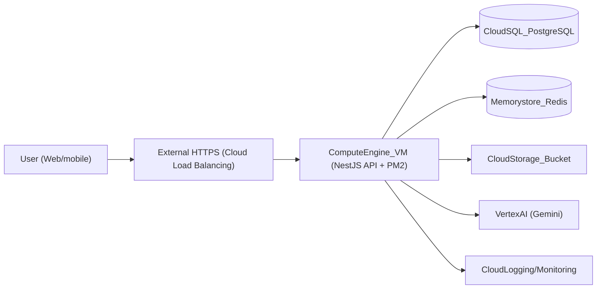

### Kiến trúc triển khai AI-LMS trên GCP (giai đoạn 1)

- **Backend**: NestJS monolith chạy trên 1 Compute Engine VM (PM2 hoặc systemd).
- **Database**: Cloud SQL for PostgreSQL (thay cho Postgres container local).
- **Redis / Queue**: Memorystore for Redis (thay Redis container, dùng cho BullMQ).
- **Storage**: Cloud Storage bucket cho video, thumbnail, tài liệu.
- **AI**: Vertex AI (Gemini) cho generate quiz, grade essay (thông qua adapter `AiProvider`).

### Biến môi trường quan trọng

- **App & DB**
  - `PORT`
  - `POSTGRES_USER`, `POSTGRES_PASSWORD`, `POSTGRES_DB`, `POSTGRES_HOST`, `POSTGRES_PORT`
  - `DATABASE_URL` (trỏ tới Cloud SQL instance trong môi trường production)

- **Auth / Security**
  - `JWT_ACCESS_SECRET`, `JWT_REFRESH_SECRET`
  - `JWT_ACCESS_EXPIRES_IN`, `JWT_REFRESH_EXPIRES_IN`

- **Redis / Queue**
  - `REDIS_HOST`, `REDIS_PORT`, `REDIS_PASSWORD` (Memorystore endpoint trong production)

- **GCP / Vertex AI (tùy chọn, khuyến nghị dùng Workload Identity thay vì key)**
  - `GCP_PROJECT_ID`
  - `GCP_LOCATION` (ví dụ: `us-central1`)
  - `VERTEX_AI_MODEL` (ví dụ: `gemini-1.5-pro`)

Các secret (JWT, DB password, Redis password, SMTP, v.v.) nên được lưu trong **Secret Manager** và inject vào VM thông qua environment hoặc file config runtime.

### Checklist triển khai Compute Engine

- **1. Build & publish image**
  - Build Docker image backend local hoặc với Cloud Build.
  - Push image lên Artifact Registry.

- **2. Tạo Cloud SQL + Memorystore**
  - Tạo Cloud SQL PostgreSQL, bật automated backups + point-in-time recovery.
  - Tạo Memorystore Redis, giới hạn network chỉ VM/backend subnet.

- **3. Tạo VM & deploy**
  - Tạo VM (e2-medium hoặc e2-standard-2) trong cùng region với Cloud SQL / Memorystore.
  - Cài Docker hoặc Node.js + PM2 (tùy chiến lược deploy).
  - Cấu hình environment theo config NestJS (`ConfigModule`).
  - Chạy `npm run prisma:migrate:deploy` trước khi start app.

- **4. Networking & security**
  - Dùng Cloud Load Balancing + managed SSL certificate cho HTTPS.
  - Hạn chế firewall rule: chỉ mở port HTTP/HTTPS public, các port DB/Redis chỉ allow nội bộ VPC.
  - Gán service account với quyền tối thiểu (Cloud SQL Client, Logging Writer, Monitoring Metric Writer, Vertex AI User nếu cần).

- **5. Observability**
  - Đảm bảo log stdout/stderr (structured JSON) được Cloud Logging thu thập.
  - Tạo dashboard Cloud Monitoring cho: latency, error rate, CPU/RAM VM, kết nối DB.

