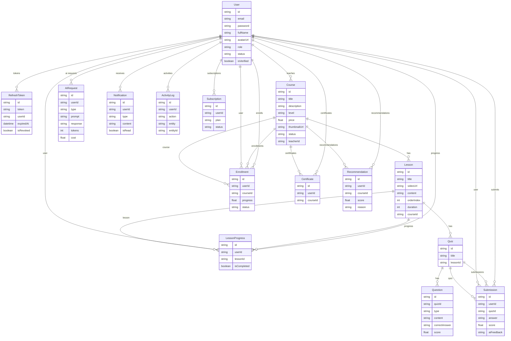

### ERD – AI-LMS (High Level)

#### Core Entities

- **User**
  - Fields: `id`, `email`, `password`, `fullName`, `avatarUrl`, `role`, `status`, `isVerified`, timestamps.
  - Relations:
    - 1–N với `Course` (teacher courses).
    - 1–N với `Enrollment`, `Submission`, `LessonProgress`, `AIRequest`, `Notification`, `ActivityLog`, `RefreshToken`, `Certificate`, `Subscription`, `Recommendation`.

- **Course**
  - Fields: `id`, `title`, `description`, `level`, `price`, `thumbnailUrl`, `status`, `teacherId`, timestamps.
  - Relations:
    - N–1 với `User` (teacher).
    - 1–N với `Lesson`, `Enrollment`, `Certificate`, `Recommendation`.

- **Lesson**
  - Fields: `id`, `title`, `videoUrl`, `content`, `orderIndex`, `duration`, `courseId`, timestamps.
  - Relations:
    - N–1 với `Course`.
    - 1–N với `Quiz`, `LessonProgress`.

- **Enrollment**
  - Fields: `id`, `userId`, `courseId`, `progress`, `status`, `enrolledAt`.
  - Relations:
    - N–1 với `User`.
    - N–1 với `Course`.
  - Unique: `(userId, courseId)`.

- **LessonProgress**
  - Fields: `id`, `userId`, `lessonId`, `isCompleted`, `completedAt`.
  - Relations:
    - N–1 với `User`.
    - N–1 với `Lesson`.
  - Unique: `(userId, lessonId)`.

- **Quiz**
  - Fields: `id`, `title`, `lessonId`, `createdAt`.
  - Relations:
    - N–1 với `Lesson`.
    - 1–N với `Question`, `Submission`.

- **Question**
  - Fields: `id`, `quizId`, `type`, `content`, `correctAnswer`, `score`.
  - Relations:
    - N–1 với `Quiz`.

- **Submission**
  - Fields: `id`, `userId`, `quizId`, `answer`, `score`, `aiFeedback`, `submittedAt`.
  - Relations:
    - N–1 với `User`.
    - N–1 với `Quiz`.
  - Unique: `(userId, quizId)`.

- **AIRequest**
  - Fields: `id`, `userId`, `type`, `prompt`, `response`, `tokens`, `cost`, `createdAt`.
  - Relations:
    - N–1 với `User`.

- **Notification**
  - Fields: `id`, `userId`, `type`, `content`, `isRead`, `createdAt`.
  - Relations:
    - N–1 với `User`.

- **ActivityLog**
  - Fields: `id`, `userId`, `action`, `entity`, `entityId`, `metadata`, `createdAt`.
  - Relations:
    - N–1 với `User`.

- **RefreshToken**
  - Fields: `id`, `token`, `userId`, `expiredAt`, `isRevoked`, `createdAt`.
  - Relations:
    - N–1 với `User`.

- **Certificate**
  - Fields: `id`, `userId`, `courseId`, `issuedAt`.
  - Relations:
    - N–1 với `User`.
    - N–1 với `Course`.
  - Unique: `(userId, courseId)`.

- **Subscription**
  - Fields: `id`, `userId`, `plan`, `status`, `startedAt`, `endedAt`.
  - Relations:
    - N–1 với `User`.

- **Recommendation**
  - Fields: `id`, `userId`, `courseId`, `score`, `reason`.
  - Relations:
    - N–1 với `User`.
    - N–1 với `Course`.

---

### ERD (Mermaid)

